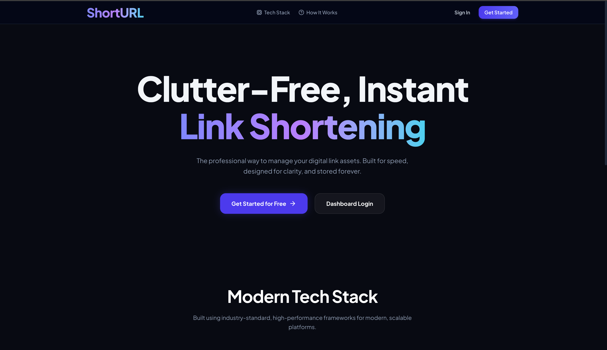
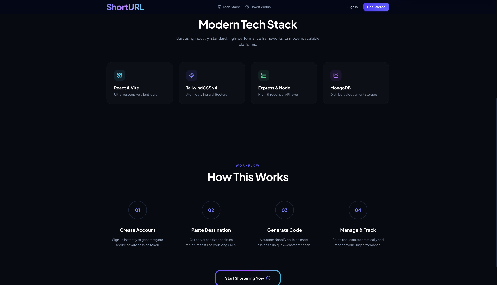
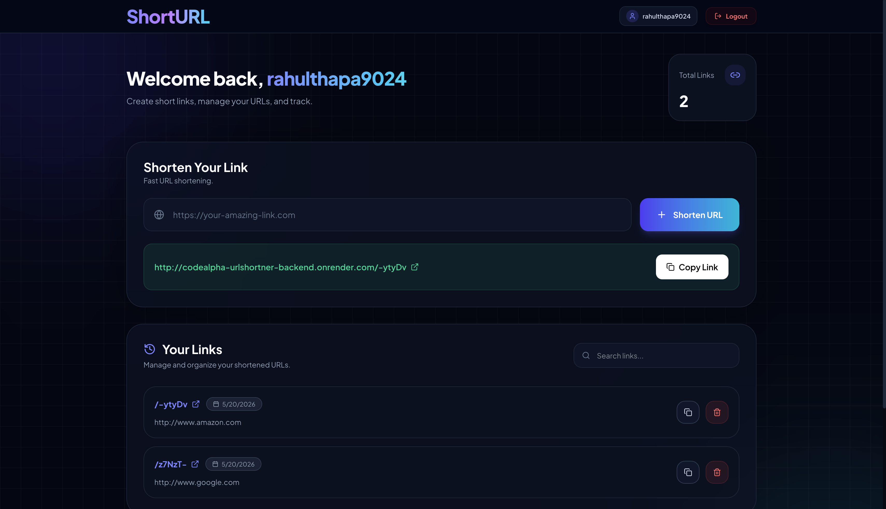
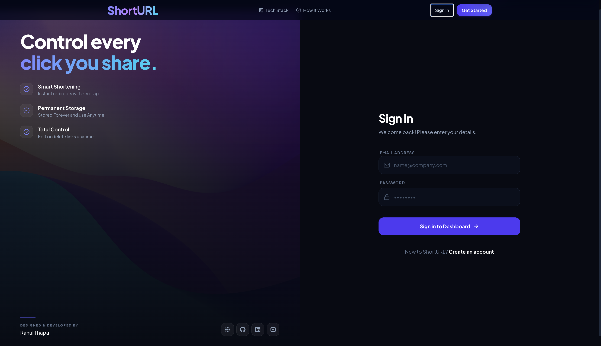
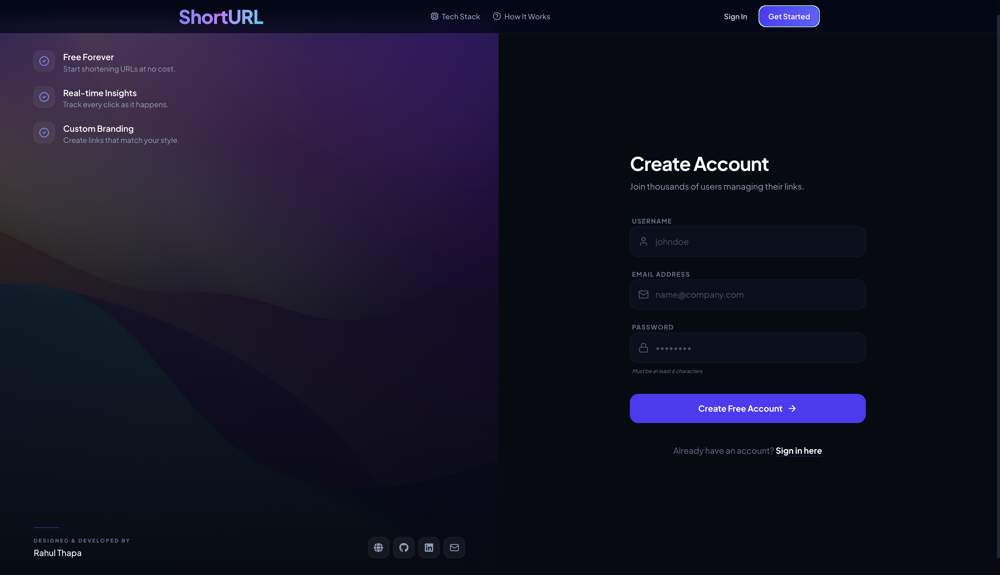

# URL Shortener

A full-stack URL shortening service built with the MERN stack (MongoDB, Express, React, Node.js) and styled with Tailwind CSS. It allows users to shrink long links, manage their URLs, and simplify sharing.
## 🌐 Live Demo :-https://code-alpha-url-shortner-frontend.vercel.app
## 📷 Preview Images

<p align="center">
  
  
</p>

<p align="center">
  
  
## 🚀 Tech Stack

### Frontend
- **Framework:** React with Vite
- **Styling:** Tailwind CSS
- **Routing:** React Router DOM
- **Icons:** Lucide React & React Icons

### Backend
- **Runtime:** Node.js
- **Framework:** Express.js
- **Database:** MongoDB (via Mongoose)
- **Authentication:** JSON Web Tokens (JWT) & bcryptjs
- **Validation:** Zod
- **URL Generation:** nanoid

## ⚙️ How it Works

1. **Authentication:** Users can register and log in. User passwords are encrypted using `bcryptjs`, and sessions are managed securely using `jsonwebtoken` (JWT) stored in HTTP-only cookies.
2. **URL Shortening:** Once authenticated, users can paste a long URL. The backend generates a unique, collision-resistant short code using `nanoid` and saves the mapping in MongoDB.
3. **Redirection:** When someone visits the shortened link, the backend looks up the corresponding long URL in the database and automatically redirects the user to the original destination.

## 🛠️ How to Run Locally

Follow these steps to get the project up and running on your local machine.

### Prerequisites
- [Node.js](https://nodejs.org/) (v18 or higher recommended)
- A [MongoDB](https://www.mongodb.com/) account and connection string (or a local MongoDB instance)

### 1. Clone the Repository
```bash
git clone https://github.com/your-username/URLshortner.git
cd URLshortner
```

### 2. Backend Setup
Navigate to the backend directory, install dependencies, and configure environment variables.

```bash
cd backend
npm install
```

Create a `.env` file in the `backend` directory and add the following variables:

```env
PORT=3000
DB_URL=your_mongodb_connection_string_here
JWT_SECRET=your_super_secret_jwt_key
FRONTEND_URL=http://localhost:5173
```
*(Note: Change `FRONTEND_URL` to `http://localhost:5173` for local development, or keep your production URL if deploying).*

Start the backend development server:
```bash
npm run dev
# The server will start on http://localhost:3000
```

### 3. Frontend Setup
Open a new terminal window, navigate to the frontend directory, install dependencies, and configure environment variables.

```bash
cd frontend
npm install
```

Create a `.env` file in the `frontend` directory and add the following:

```env
VITE_API_BASE_URL=http://localhost:3000/
```
*(Note: Point this to your local backend server during development).*

Start the frontend development server:
```bash
npm run dev
# The application will be available at http://localhost:5173
```

## 🤝 Contributing
Contributions, issues, and feature requests are welcome! Feel free to check the issues page.

## ✍️ Author
https://github.com/rahulthapa9024
